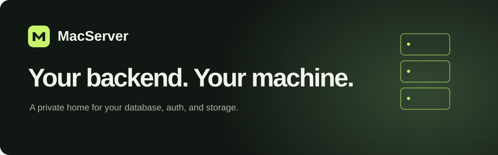

<p align="center"></p>

A private, Supabase-compatible backend for your Intel Mac. PostgreSQL, Auth, REST,
and optional Storage, Realtime, Functions, and Studio. Built for Debian 13.

**[Install guide](https://corund207.github.io/MacServer/getting-started.html)** ·
**[Explore MacServer](https://corund207.github.io/MacServer/)** ·
**[Documentation](docs/GETTING-STARTED.md)**

- Familiar Supabase client libraries and PostgreSQL tooling.
- Tailscale-only administration. No router port forwarding.
- Pinned services, encrypted backups, and guarded updates.
- Run only the components your projects need.

```sh
git clone https://github.com/corund207/MacServer.git
cd MacServer
python3 scripts/bootstrap.py preflight --state-parent /srv
```

Start on the Mac with Debian 13 installed. This checks readiness; it does not
install services. Follow the guide for hardware checks, setup, and recovery.

**Status:** source tooling is available; the physical MacBook has not been qualified.
Public app ingress and real project access tests must pass before production data.
One stack shares Auth and keys; use separate stacks for unrelated trust domains.

[Development](docs/DEVELOPMENT.md) · [Backups](docs/BACKUP-RESTORE.md) ·
[Launch checklist](docs/FINAL-VERIFICATION.md) · [Current work](context/NEXT-PHASE.md)
