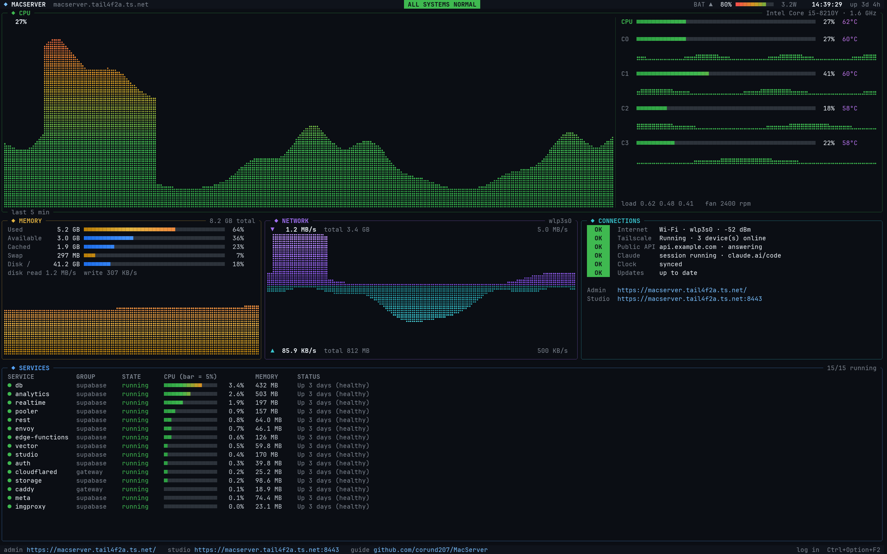

# MacServer: the step-by-step guide

This guide takes you from a 2019 MacBook Air to a private server that runs the
backend (database, sign-in, file storage) for your apps. You don't need to know
Linux. Follow the parts in order; each one says what you will see.

It takes about an hour, most of it waiting.

1. [What you need](#1-what-you-need)
2. [Set up Tailscale](#2-set-up-tailscale-5-minutes)
3. [Make the USB stick](#3-make-the-usb-stick)
4. [Let the Mac start from USB](#4-let-the-mac-start-from-usb-once)
5. [Install](#5-install-about-20-minutes)
6. [First start](#6-first-start-about-15-minutes)
7. [Open your admin page](#7-open-your-admin-page)
8. [Connect an app](#8-connect-an-app)
9. [Get help from Claude](#9-get-help-from-claude)
10. [Everyday use](#10-everyday-use)
11. [Update MacServer on an installed Mac](#11-update-macserver-on-an-installed-mac)
12. [If something goes wrong](#12-if-something-goes-wrong)

---

## 1. What you need

- The **2019 MacBook Air** and its charger. Everything on it will be erased.
- A **USB stick** of 4 GB or more (plus a USB-C adapter if the stick is USB-A).
  It will be erased too.
- A **Windows PC** to make the USB stick.
- **Wi-Fi** (the name and password). A USB-C Ethernet adapter also works.
- A free **[Tailscale](https://tailscale.com)** account. It's how you reach the
  server privately from your phone and computer.
- Optional, for apps used by other people on the Internet: a domain on
  **Cloudflare** (free plan). You can add this later.
- Optional, for AI help on the server: a **claude.ai** plan (Pro or Max).

## 2. Set up Tailscale (5 minutes)

Tailscale makes a private network between your own devices. The server is only
reachable through it: nobody else on the Internet or your home Wi-Fi can reach it.

1. Sign up at [tailscale.com](https://tailscale.com).
2. Install the Tailscale app on your **phone** and your **computer**, and sign in
   with the same account.
3. Open the [DNS settings](https://login.tailscale.com/admin/dns) and turn on
   **MagicDNS** and **HTTPS Certificates**. (The admin page needs both.)

## 3. Make the USB stick

The stick holds the MacServer installer. Yours is a **personal** copy: it includes
Apple's Wi-Fi driver files for your Mac, so Wi-Fi works from the first screen.
Apple doesn't allow sharing those files, so never give this image to anyone.

**Once:** install WSL (Linux inside Windows). Open PowerShell and run:

```powershell
wsl --install -d Debian
```

Restart Windows when it asks, and pick a Linux username and password when the
Debian window opens.

**Build the image.** Get the MacServer folder (Code → Download ZIP on
[GitHub](https://github.com/corund207/MacServer), or `git clone`), open PowerShell
**in that folder**, and run:

```powershell
powershell -ExecutionPolicy Bypass -File iso\make-personal-usb.ps1
```

The first run takes about 20 minutes (it downloads the Wi-Fi files from Apple and
builds the system); later runs take about a minute. It ends with
`Done: ...\Downloads\macserver-personal-wifi.iso`.

**Write it to the stick.** Install [balenaEtcher](https://etcher.balena.io), choose
**Flash from file** → `macserver-personal-wifi.iso`, select your USB stick, and
**Flash**.

## 4. Let the Mac start from USB (once)

Macs with a T2 chip only start macOS unless you allow otherwise.

1. Turn the Mac on while holding **⌘ Command + R** (if macOS is already erased,
   hold **⌥ Option + ⌘ Command + R** to load it from the Internet).
2. Choose **Utilities → Startup Security Utility**. Enter the Mac's password if asked.
3. Set **Secure Boot: No Security** and **Allow booting from external or removable
   media**.
4. Shut the Mac down.

## 5. Install (about 20 minutes)

1. Plug in the charger and the USB stick. Turn the Mac on while holding
   **⌥ Option**, and choose the orange **EFI Boot** disk.
2. The MacServer installer starts. You'll see "Wi-Fi firmware loaded from the USB
   stick", then the Wi-Fi list:
   - Choose your network with the arrow keys and press Enter, then type the password.
   - When **Deactivate** appears next to your network, you're connected. Choose
     **Quit**.
3. The installer checks the Internet and **sets the clock** by itself (a Mac with
   a flat battery often has the wrong date, which breaks secure downloads). If it
   still says "not connected", read the reason it shows. If it mentions the clock
   or a certificate, choose **Set the date and time by hand**.
4. Answer the questions:
   - **Server name**: e.g. `macserver`. Your addresses will use it.
   - **Username and password**: for logging in to the server and for `sudo`.
   - **Encrypt the disk**: yes. Pick a passphrase you won't forget: you type it
     every time the Mac starts, and without it the data is gone.
   - **Time zone**, **built-in Wi-Fi** (keep it on), **Tailscale auth key** (just
     press Enter to skip; you'll scan a QR code instead).
5. Type **ERASE** to confirm. The installer erases the Mac's disk and installs
   everything. Leave it alone until it says **MacServer is installed**.
6. Remove the USB stick and press Enter. The Mac restarts.

## 6. First start (about 15 minutes)

1. The Mac asks for the **disk passphrase**. Type it on the Mac's keyboard and
   press Enter. (Nothing appears while you type. That's normal.)
2. Setup continues by itself: security updates, firewall, Docker, Supabase.
3. A **QR code** appears. Scan it with your phone's camera and sign in to
   Tailscale. This adds the server to your private network.
4. When setup is done, the screen switches to the **MacServer dashboard**:



The dashboard stays on screen all the time and never goes dark. It looks and works
like [btop](https://github.com/aristocratos/btop), with the things a server needs:

- **Top bar**: the server's name, an overall status (green = all good), battery,
  the time and uptime.
- **CPU**: a live graph of the last few minutes, and each core's load and temperature.
- **Memory**: used, available, cached, swap and disk, with a graph; disk activity.
- **Network**: download above, upload below, with speeds and totals.
- **Connections**: Internet (and Wi-Fi signal), Tailscale, the public API, Claude,
  clock and updates, each with an **OK / WARN / DOWN / OFF** tag, and your addresses.
- **Services**: every Supabase container with its CPU, memory and status. A stopped
  one turns red and moves to the top.

**Text size.** The default fits about 230 x 64 characters on the Mac's screen. To
change it, add `DASHBOARD_FONT_PX=16` (smaller, more detail) or `22` (bigger) to
`/etc/macserver/macserver.conf`, then run `sudo ./install.sh --redo host` from the
MacServer folder and log out of the Mac's screen.

If the Mac's graphics ever fail, the screen falls back to a simpler text version of
the same dashboard by itself.

You can't type into the dashboard; it's safe to leave on. To use the Mac's own
screen for commands, press **Ctrl + ⌥ Option + F2** (hold **fn** too if the
brightness changes instead) and log in. **Ctrl + ⌥ Option + F1** brings the
dashboard back.

You can close the lid; the server keeps running. Leave it on the charger.

## 7. Open your admin page

On your phone or computer (with Tailscale on), open:

```
https://macserver.<your-tailnet>.ts.net/
```

Replace `macserver` with your server name. `<your-tailnet>` is shown at the bottom
of the dashboard and in the Tailscale app. The admin page shows the same health
information as the dashboard, the **API URL** and **app key** (with Copy buttons),
and the **Start Claude session** button.

**Supabase Studio** (tables, users, files, SQL editor) is at the same address with
`:8443` at the end. It asks for a username and password: get them from the server
with `sudo macserver keys` (see [Everyday use](#10-everyday-use) for how to run a
command).

## 8. Connect an app

Your app needs two things from the admin page: the **API URL** and the
**publishable key** (or anon key). For example, in JavaScript:

```js
import { createClient } from '@supabase/supabase-js'
const supabase = createClient('<API URL>', '<publishable key>')
```

- **Only you** (apps on your own devices): use the tailnet address
  `https://macserver.<your-tailnet>.ts.net:8443`. It works wherever Tailscale is on.
- **Other people** (a public website or app): turn on the public route. You need a
  domain on Cloudflare. Run `sudo macserver public setup` and follow the steps. It
  gives you an address like `https://api.yourdomain.com`. Only the app parts of
  Supabase are public; Studio, the database and the admin page never are.
- **Never** put the **secret** or **service_role** key in an app. It can do
  anything to your data. It belongs only on servers you control.
- In Studio, turn on **Row Level Security** for every table your app reads, and add
  policies. Without them, anyone with the public key could read the table.

Supabase's own docs cover the rest: [supabase.com/docs](https://supabase.com/docs).

## 9. Get help from Claude

Claude Code is installed on the server with a MacServer skill: it knows what the
server runs, how to connect apps, and what it must never do (like opening ports).

**Once**, sign in (needs a claude.ai Pro or Max plan):

1. Log in to the server (see below) and run `claude`. Open the link it shows on your
   phone or computer, sign in, and paste the code back if asked. Type `/exit`.
2. Run `claude remote-control`, answer **y**, then press **Ctrl + C**.

**Then**, whenever you want help: on the admin page, click **Start Claude session**,
then **Open session**. It opens in claude.ai/code or the Claude app. Ask things like
"set up a table for my notes app with sign-in" or "why is auth failing?". Click
**Stop session** when you're done.

## 10. Everyday use

**Running a command.** From your computer (with Tailscale on) open a terminal and run
`ssh <username>@macserver`, or use the Mac's screen (**Ctrl + ⌥ Option + F2**).
Logging in shows a summary; `macserver dashboard` opens the full dashboard (q quits).

| Command | What it does |
| --- | --- |
| `sudo macserver status` | Health at a glance |
| `sudo macserver keys` | App keys and the Studio login (keep them private) |
| `sudo macserver update` | Backs up the database, then installs updates |
| `sudo macserver backup` | Saves a copy of the database in `/var/backups/macserver` |
| `sudo macserver logs auth` | Shows what a service is doing (`auth`, `rest`, `db`, `storage`...) |
| `sudo macserver restart` | Restarts Supabase |
| `sudo macserver public off` | Takes the public API off the Internet immediately |
| `sudo macserver doctor` | Checks network, DNS and the Mac's drivers |

Good habits:

- Run `sudo macserver update` about once a month (the dashboard shows **WARN** next
  to Updates when there are some). Security updates install by themselves.
- Copy backups off the Mac now and then (they're only on the Mac's disk).
- After a **power cut**, the Mac waits for the disk passphrase. That's what keeps
  your data safe if the laptop is stolen.
- The battery stops charging at 80% when the Mac supports it, so it lasts longer
  on the charger.

## 11. Update MacServer on an installed Mac

New versions of MacServer (like a new dashboard) don't need a reinstall. Log in to
the server and run:

```sh
git clone https://github.com/corund207/MacServer.git ~/MacServer   # first time only
cd ~/MacServer && git pull
sudo ./install.sh --redo host     # the screen dashboard
sudo ./install.sh                 # anything new or unfinished (for example Claude)
sudo ./install.sh --redo admin    # the admin page
```

If you're logged in on the Mac's own screen, type `exit` afterwards and the new
dashboard appears.

## 12. If something goes wrong

| What you see | What to do |
| --- | --- |
| The Mac won't start from the USB stick | Redo [part 4](#4-let-the-mac-start-from-usb-once), then hold ⌥ Option at power on |
| Installer says "not connected" though Wi-Fi shows Deactivate | Read the reason on screen. Clock or certificate: choose **Set the date and time by hand** |
| The screen is black | Press Shift. If it stays black, type the disk passphrase and press Enter (the prompt may not show) |
| The dashboard says **Setup has not finished** | Log in (Ctrl + ⌥ Option + F2) and run `sudo /opt/macserver-src/install.sh`. It continues where it stopped |
| Admin page says **Forbidden** | Your Tailscale login isn't on the list: log in and add it to `ADMIN_LOGINS` in `/etc/macserver/macserver.conf` |
| Admin page doesn't open at all | Tailscale must be on for that device; check MagicDNS and HTTPS in [part 2](#2-set-up-tailscale-5-minutes) |
| A Supabase service is red | `sudo macserver logs <name>`, then `sudo macserver restart` |
| Claude button says to sign in | Do the once-only steps in [part 9](#9-get-help-from-claude) |

More detail: [troubleshooting](TROUBLESHOOTING.md) · [how the network works](NETWORK.md) ·
[security design](SECURITY.md) · [installing Debian yourself](MANUAL-INSTALL.md) ·
[development](DEVELOPMENT.md)
